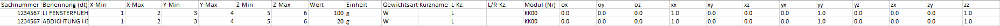
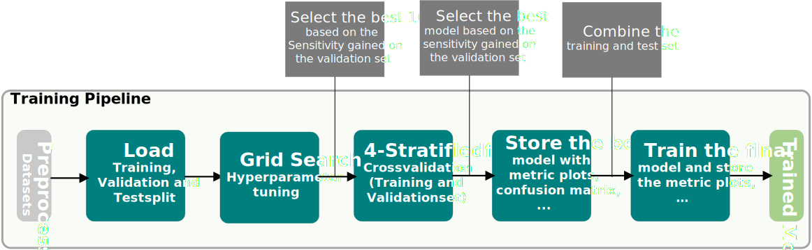
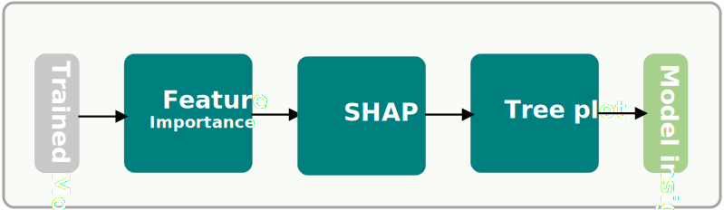
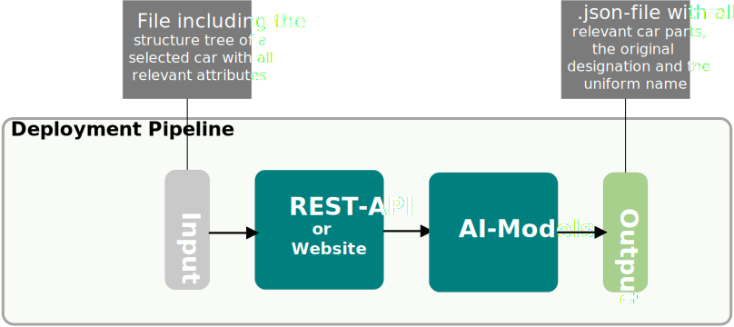

# Component Identification for Geometric Measurements in the Vehicle Development Process Using Machine Learning

## 🚘🔍 Capi 
Capi (CAr-Part-Identifier) is a service developed as part of my master thesis and is based on two machine learning models. Capi identifies car parts that are relevant for geometric measurements during the vehicle development process and is one of three components of a tool that automates the measurement process for different measures and compares them to guidelines and targets. </br>
The input for the models needs to be a excel file which contains a list of car parts (structure tree) including their metadata. Sample excerpt:


The output of the model is a list of all relevant car parts in the following format: </br>
```
  {
    "Part number": ["Original part designation", "Uniform name"]
  }
```
This output is used by a CATIA makro to load the car parts into a CATIA parametric model which then automatically performs the measurements. 

The part number is used to load the parts from the database, the unit name is used to assign the parts to the various measurements, and the original part designation can be used to manually check whether the uniform name was correctly assigned by the ML-model.

Capi is accessible via a ([REST-API](http://10.3.13.137:7070/docs#/default/post_relevant_parts_api_get_relevant_parts__post)) or a ([website](https://car-part-identification.streamlit.app/)). The REST-API is used for production to integrate with the measurement tool and the website is used in the development process to test the models and to get quick feedback from customers.

## 📖 Quick Index

* [💻 Installation](#-installation)
* [🐍 Usage](#-usage-in-python)
* [🚀 Updates](#-updates)

## 💻 Installation
1. Clone or download the repository
2. (optional) Create a virtuel environment: 
```bash
conda create -n envMesstool python=3.10
```
3. (optional) Activate the created environment 
```bash 
conda activate envMesstool 
```
4. Go to the root directory
5. Installation of the requirements: 
```bash 
pip install -r requirements.txt
``` 
6. Add the data folder to the root directory
7. Perfect, the messtool is ready to use! If not, run 
```bash 
pip install -e .
``` 
or 
```bash
python setup.py install
``` 

## 🐍 Usage in Python
The project contains 5 different pipelines. 
- Labeling pipeline: Preparation of raw data, feature selection, add label columns, and prelabeling with the trained models
- Data pipeline: Combine all datasets to one, feature engineering, data preprocessing, data augmentation, and splitting the dataset into train, validation, and testset
- Training pipeline: Training of the binary and/or multiclass models using grid search hyperparametertuning and k-fold-crossvalidation 
- Explainability pipeline: Create shap plots, tree plots, and store the feature importantance for the final models 
- Deployment pipeline: Deploy the model using FastAPI and Docker or using a Streamlit website

Since there is no data provided in this repository, please add your data by using the following folder structure:</br>
master-thesis/ </br>
├─ data/ </br>
│  ├─ labeled/ </br>
│  ├─ pre_labeled/ </br>
│  ├─ processed/ </br>
│  ├─ preprocessed/ </br>
│  ├─ raw/ </br> 
│  ├─ raw_for_labeling/ </br>

### Labeling pipeline


This pipeline is used for preparing and prelabeling the raw data. 

The first step in using this pipeline is to add all raw datasets (excel files), which you want to add for training new models, to the folder "raw_for_labeling". Each excel file contains the structure tree of one vehicle and have to include at least all relevant attributes, which are:
- Sachnummer
- Benennung (dt)
- X-Min
- X-Max
- Y-Min
- Y-Max
- Z-Min
- Z-Max
- Wert
- Einheit
- Gewichtsart
- Kurzname
- L-Kz.
- L/R-Kz.
- Modul (Nr)
- Code
- ox
- oy
- oz
- xx
- xy
- xz
- yx
- yy
- yz
- zx
- zy
- zz

After that, run the **label.py** file which you can find here: </br>
master-thesis/  </br>
├─ src/ </br>
│  ├─ labeling_pipeline/ </br>
│  │  ├─ label.py </br>

This file will apply the following steps:
- **Data Preparation**: Keeps only vehicle parts from relevant modules. All parent folders are removed
- **Feature Selection**: Keeps only the features which are used for training the models
- **Add label columns**: Adding and initializing the label columns ("Relevant fuer Messung" with 0 and "Einheitsname" with "Dummy")
- **Prelabeling**: Using the trained model to identify the relevant car parts and classify a uniform name ("Einheitsname") for each relevant car part

After these steps, the prepared and prelabeled datasets are stored in the folder "pre_labeled". 
Now please check carefully if the records are labeled correctly. If not, you will have to correct this manually.
This is a critical part, because incorrectly labeled data can lead to a significant drop in performance!

After reviewing the pre-labeled datasets, move them to the labeled folder.

### Data pipeline


This pipeline is used to generate a new training, validation, and testsplit for training the models and can be executed with the file ***generate_dataset.py***. </br>
master-thesis/  </br>
├─ src/ </br>
│  ├─ data_pipeline/ </br>
│  │  ├─ generate_dataset.py </br>

In the first step, all datasets which are in the data folder "labeled" will combined to one.  

Then, in the feature engineering step, the bounding box information is converted so that the number of features is reduced. </br>
In the original data set, a bounding box is represented by the minimum and maximum values in x,y,z, a shift vector and a rotation matrix. </br>
Here, this information is used to convert it into the length, width, height, the center point and an orientation vector of the bounding box. This reduces the number of features for the representation of the bounding box from 18 to 6 features. In addition, two more features (volume and density) are calculate.

The next step is the preprocessing of the data set. This involves a pre-selection of irrelevant car components based on the bounding box features (volume and position) and a cleaning of the component designations and their conversion into numerical vectors.

Since a stratified training/validation/test split is used to ensure that the datasets are balanced across classes, some data augmentation techniques are used as needed to create synthetic car parts. The goal here is to have at least 2 / (1 - percentage trainset/100) car parts, so that each split has at least one car part for each uniform name. </br> 
The synthetic designations are generated by adding random mistakes, switching words or generating new designations using GPT3.5. The synthetic bounding box information is randomly generated, however, it must be within a validated range in terms of position, length, width, height and volume to the original components of the same class. The other features are copied from the original car parts. 

The last step splits the dataset at first into 1-x training and x validation set. Then, the validationset is splitted into 1-x validationset and x testset. (x can be defined in the config.yaml file)

### Training pipeline


This pipeline is used to train and evaluate new models. Currently, the machine learning methods LightGBM, XGBoost, and CatBoost are available for this purpose. All settings, such as metrics, loss functions, hyperparameters, etc. can be set in the config.yaml file.

The input of the pipeline is the training, validation and test split created with the data pipeline. Set the paths to that dataset folder in the config file.

The first step after loading the data sets is the tuning of the hyperparameters via grid search. Here, 81 models are trained iteratively by varying over 4 hyperparameters. </br>
After that, the top x % [default = 10] of the models are selected by the best area under the curve (auc) score and then validated using k-fold crossvalidation [default = 4]. </br>
The model with the highest auc score after crossvalidation is then selected as the "best" model and trained on a larger trainset that combines the previous trainset and the testtest to use the entire available data. Only the validation set is retained for validation of the final model.

After setting the desired training parameters, the training process can be started by executing the ***main.py*** file. </br>
master-thesis/  </br>
├─ src/ </br>
│  ├─ training_pipeline/ </br>
│  │  ├─ main.py </br>

The trained models and its files to validate and compare models are stored in following folder: </br>
master-thesis/ </br>
├─ src/ </br>
│  ├─ training_pipeline/ </br>
│  │  ├─ trained_models/ </br>

After comparing the new trained model(s), update the models in the following folder with the new models if they have a better performance: </br>
master-thesis/ </br>
├─ final_models/ </br>

### Explainability pipeline


This pipeline is used to generate insight about the predictions of the final models and can be executed with ***xAi.py***. </br>
master-thesis/ </br>
├─ src/ </br>
│  ├─ explainability/ </br>
│  │  ├─ xAi.py </br>

It uses the folder "final_models" folder to generate insights in the following way:

First, an Excel file is created with all the features that the model has trained on and their importance to the model output. </br>
Then the SHAP library is used to create swarm diagrams, which also help to understand which features affect the model forprediction. </br>
In the last step, a tree index can be selected to draw this tree. Looking at these trees can help to understand misclassifications, but it is time consuming, because a model contains about 300 - 600 trees.

The results of this pipeline are stored in the folder "final_models" for each case (binary and multiclass): </br>
master-thesis/ </br>
├─ final_models/ </br>
│  ├─ Binary_model </br>
│  │  ├─ xAi </br>

### Deployment pipeline


The current options to test and/or deploy the models are a streamlit website which ist hosted on github and a Rest-API which is hosted on an AWS server. </br>
The streamlit website is only used for testing, debugging, and getting feedback of the specialty department (internal customer and users). </br>   
The Rest-API developed with FastAPI and virtualized with Docker is used for production and is addressed via a Catia macro. </br>
At the moment, the input for the models is an excel file with all relevant metadata and the structure tree of a vehicle. The output is a json file which contains only the identified car parts with the id, the original designation and an uniform name which is used in Catia for further steps.

Example Output:
```
{
  "1234567": [
    "RESTDACH",
    "DACHAUSSENHAUT"
  ],
  "23456789": [
    "AUSSENHAUT HKL OBEN",
    "HECKKLAPPE AUSSENHAUT"
  ],
  "98765432": [
    "ZB SKYROOF DACHMODUL",
    "GLASDACH (SA)"
  ]
}
```

### Tests
In order to test functions individually and independently for proper operation, unit tests were developed using the pyTest library. These can be executed in the command line by using the following command in the root folder:
``` 
pytest 
``` 


## 🚀 Updates

**2023.08.03**
Update models -> Now trained on 33 vehicles instead of 8