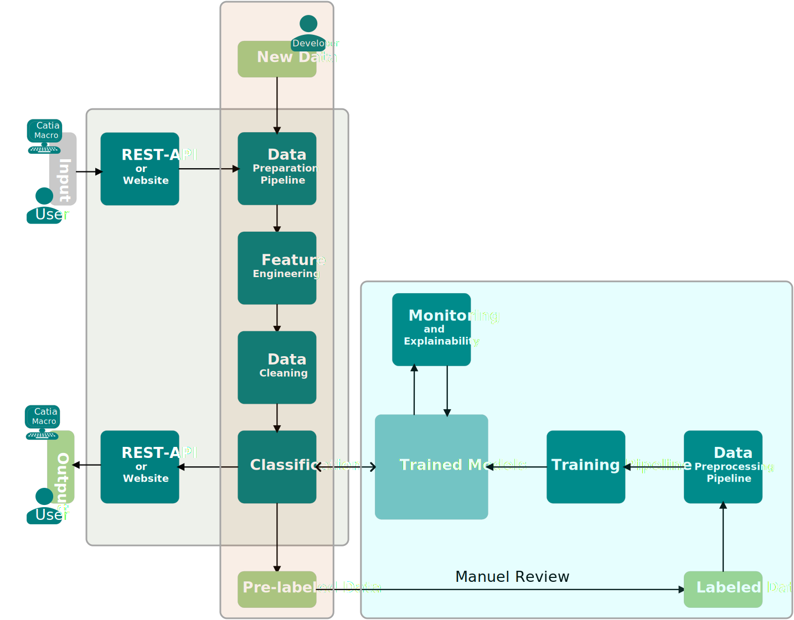
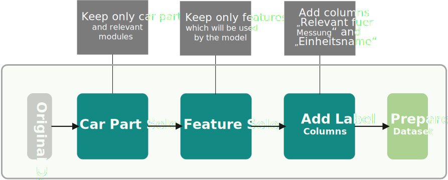
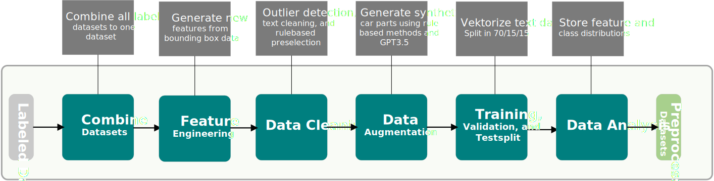

# Component Identification for Geometric Measurements in the Vehicle Development Process Using Machine Learning

## 🚘🔍 CaPI 
CaPI (Car-Part-Identifier) is a service developed as part of my master's thesis and is based on two machine learning models. CaPI identifies car parts that are relevant for geometric measurements during the vehicle development process.It is one of three components of a tool that automates the process of determining various dimensions and comparing them to guidelines and targets. </br>
The input for the models is an excel file which contains a list of car parts (structure tree) including their metadata, for example:


Out of the follwing list, the relevant car parts are identified and output in the format given below:
- BLENDE HBL
- BLENDE LADEKANTE
- BLENDE BSAEULE HINTEN
- BODENVERKLEIDUNG HINTEN
- DACHANTENNE
- DACHAUSSENHAUT
- DICHTUNG HECKKLAPPE
- EINLEGEBODEN GEPAECKRAUM
- FRONTSCHEIBE
- GLASDACH (SA)
- HBL
- HECKKLAPPE AUSSENHAUT
- HECKSCHEIBE
- HIMMEL (SA)
- VERDECK
- INNENSPIEGEL
- KOPFSTUETZE_MITTE_HINTEN
- LI ABDECKLEISTE EINSTIEG HINTEN
- LI ABDECKUNG FENSTERRAHMEN HINTEN
- LI ABDECKUNG FENSTERRAHMEN VORNE
- LI BLENDE A-SAEULE
- LI FENSTERFUEHRUNG
- LI HALTEGRIFF HINTEN
- LI HALTEGRIFF VORNE
- LI KANTENSCHUTZ HINTEN
- LI KANTENSCHUTZ VORNE
- LI SEITENVERKLEIDUNG VORNE
- LI SONNENBLENDE
- SEITENVERKLEIDUNG GEPAECKRAUM
- SITZBEZUG HINTEN
- SPOILER
- VERKLEIDUNG STOSSFAENGER

```
  {
    "Part number": ["Original part designation", "Uniform name"]
  }
```

This output is used by a CATIA macro to load the car parts into a CATIA parametric model, which then automatically performs the measurements and the comparisons with the guidelines. 

The part number is used to load the parts from the database, the uniform name to assign the parts to the various measurements, and the original part designation to manually check whether the uniform name was correctly assigned by the machine learning model.

CaPI is accessible via a ([REST-API](http://10.3.13.137:7070/docs#/default/post_relevant_parts_api_get_relevant_parts__post)) or a ([website](https://car-part-identification.streamlit.app/)). The REST-API is implemented for production to integrate the measurement tool and the website is set up for the development process to test the models and to get quick feedback from the department/users.

## 📖 Quick Index

* [💻 Installation](#-installation)
* [⛏️ Architecture](#-architecture)
* [🐍 Usage](#-usage-in-python)
* [🚀 Updates](#-updates)

## 💻 Installation
1. Clone or download the repository
2. (Optional) Create a virtual environment
```bash
conda create -n envMesstool python=3.10
```
3. (Optional) Activate the created environment 
```bash 
conda activate envMesstool 
```
4. Go to the root directory of the project
5. Install the requirements
```bash 
pip install -r requirements.txt
``` 
6. Go to the src/config.yaml file and change the project path with your directory.
7. DONE, the code is ready to use! 

## ⛏️ Architecture


This project follows a three-component architecture, comprising of three main processes - prelabeling, training, and deployment.

**PRELABELING** </br>
The prelabeling process, highlighted in orange, utilizes our already trained models to prelabel newly available data, thus reducing the manual effort required for data labeling. Developers only need to review the prelabeled data and make corrections to any misclassified parts.

**TRAINING** </br>
The training process, highlighted in blue, uses the labeled data as input to the preprocessing pipeline that generates the training, validation, and test splits. The models are then trained, and if they are better than the existing models, they can replace them. In order to compare the models, this process also includes options to analyze the feature and class distributions, the explainability, and the results of the trained models.

**DEPLOYMENT** </br>
The deployment process, highlighted in green, has two options - website and REST-API.
The website is used only for testing purposes, allowing developers to quickly test new models and receive feedback from the department/ users.
The REST-API is developed for production usage, allowing users to send data as a request and to receive the identiefied car parts of the machine learning models in a json-format.

To better understand the structure of the code, the devoloped piplines to implement these processes are explained in the following briefly:

### Data Preparation Pipeline


This pipeline prepares the raw data, which means to remove irrelevant modules/samples, selecting relevant features, and adding/initializing the label columns.

### Data Preprocessing Pipeline


This pipeline merges the labeled datasets, performes feature engineering, cleanses the data, augments the data, analyzes the data, and splits the dataset into training, validation, and test set.

### Training Pipeline


This pipeline is used to train and evaluate new binary/multiclass models using grid search hyperparameter tuning and k-fold cross-validation. Currently, the machine learning methods LightGBM, XGBoost, and CatBoost are available. 

### Explainability Pipeline


This pipeline is used to generate insights about the predictions of the final models.

## 🐍 Usage in Python
Since there is no data provided in this repository, the first step is to add your data by using the following folder structure:</br>
master-thesis/ </br>
├─ data/ </br>
│  ├─ labeled/ </br>
│  ├─ pre_labeled/ </br>
│  ├─ processed/ </br>
│  ├─ raw/ </br> 
│  ├─ raw_for_labeling/ </br>

### Prelabeling New Data
For prelabeling new data, the first step is to add all new, raw datasets (excel files) to the folder "data/raw_for_labeling". 
Each excel file must contain the structure tree of a vehicle and needs at least the following attributes:
- Sachnummer
- Benennung (dt)
- X-Min
- X-Max
- Y-Min
- Y-Max
- Z-Min
- Z-Max
- Wert
- Einheit
- Gewichtsart
- Kurzname
- L-Kz.
- L/R-Kz.
- Modul (Nr)
- Code
- ox
- oy
- oz
- xx
- xy
- xz
- yx
- yy
- yz
- zx
- zy
- zz

After adding all files, you can specify some of the following settings in the src/config.yaml file: 
- binary_column and multiclass_column: Names of the label columns
- binary_label_1, binary_label_0: The labels for the binary classification
- keep_modules: Modules which should be kept
- relevant_features: Features which should be kept

Then, run the **label.py** file which you can find here: </br>
master-thesis/  </br>
├─ src/ </br>
│  ├─ deployment/ </br>
│  │  ├─ data_prelabeling.py </br>

This file executes the following steps:
- **Data Preparation**: Keep only the vehicle parts from the relevant modules. All parent folders and not needed modules are removed.
- **Feature Selection**: Keep only the features defined as relevant in the config file, which should be used for training the models.
- **Add Label Columns**: Add and initialize the label columns. ("Relevant fuer Messung" with "Nein" and "Einheitsname" with "Dummy")
- **Prelabeling**: Use the trained models to identify the relevant car parts and classify a uniform name ("Einheitsname") for each relevant car part.

After these steps, the prelabeled datasets are stored in the folder "pre_labeled". 
**Now please check if the samples are labeled correctly.** If not, you have to correct the labels manually.
This is a critical part, because incorrectly labeled data can lead to a significant drop in the model performance.
As an assistance to correctly label the datasets and to quickly detect possible errors, a checklist with all vehicles and the determined relevant components is available in the data folder.

After reviewing the pre-labeled datasets, move them to the "data/labeled" folder.

### Generate the Training Data

To generate a new training, validation, and test split for training the models, you can run the data preprocessing pipeline using the file **data_preprocessing.py**, which can be found here: </br>
master-thesis/  </br>
├─ src/ </br>
│  ├─ data_preprocessing_pipeline/ </br>
│  │  ├─ data_preprocessing.py </br>

Before running this file, you can specifiy some of the following settings in the "src/config.yaml" file:
- train_val_split: Split into (1-x)*100 % training and x*100 % validation set. (x=[0,1])
- val_test_split: Split into (1-x)*100 % validationset and x*100 % testset. (x=[0,1])
- seed: Seed for the train, val, test split
- cut_percent_of_front: All components located in the front x percent are removed. (For Example: 0.18 are all car parts up to the windshield)
- use_only_text: If true, only the designation will be used as feature. All other features are not considered.

This file executes the following steps:
- **Combine Datasets**: All datasets which are in the data folder "data/labeled" will be combined to one dataframe.
- **Feature Engineering**: The bounding box information is transformed to reduce the number of features. In the original data set, a bounding box is represented by the minimum and maximum values in x-, y-, z-direction, a shift vector, and a rotation matrix.
Here, this information is used to transform them into length, width, height, the center point in x-, y-, and z-direction, and an orientation vector of the bounding box. This reduces the number of features for representing the bounding box from 18 to 9. In addition, two more features (volume and density) are calculated.
- **Data Cleaning**: This involves a preselection of irrelevant car components based on the bounding box features (volume and position). In addition, component designations are cleaned by removing punctuation and frequently occurring words without information. The text data is then converted to numeric vectors.
- **Data Augmentation**: The synthetic designations are generated by adding random mistakes, switching words or generating new names using GPT3.5. The synthetic bounding box information is randomly generated, however, it must be within a validated range in terms of position, length, width, height, and volume in reference to the original components of the same class.
- **Training, Validation, and Test Split**: To ensure that the datasets are balanced across classes a stratified training, valiadation, test split is performed with additional help of data augmentation techniques to create synthetic car parts. The goal here is to have at least 2 / (1 - percentage trainset/100) car parts, so that each split has at least one car part for each class (uniform name). </br> 
 
### Training
After creating the dataset, you can train and evaluate new models. Currently, the machine learning methods LightGBM, XGBoost, and CatBoost are available. Before training, the dataset path and all settings, such as metrics, loss functions, hyperparameters, etc. can be set in the "src/config.yaml" file.

After setting the desired training parameters, the training process can be started by executing the ***main.py*** file. </br>
master-thesis/  </br>
├─ src/ </br>
│  ├─ training_pipeline/ </br>
│  │  ├─ main.py </br> 

This file executes the following steps:
- **Hyperparameter Tuning**: The first step after loading the datasets is the tuning of the hyperparameters via grid search. Here, 81 models are trained iteratively by varying over 4 hyperparameters. 
- **Cross-Validation**: After grid search, the top x % [default = 10] of the models are selected by the highest area under the curve (auc) score and then validated using k-fold cross-validation [default = 4].
- **Train the Final Model**: The model with the highest auc score after cross-validation is then selected as the "best" model. It is trained on a larger trainset that combines the previous train and test set to use the entire available data. The validation of the final model is performed on the original validation set.

The trained models and its files to validate and compare the models are stored in following folder: </br>
master-thesis/ </br>
├─ src/ </br>
│  ├─ training_pipeline/ </br>
│  │  ├─ trained_models/ </br>

If the new trained models have a better performance, update the final models in the following folder with the new trained models: </br>
master-thesis/ </br>
├─ final_models/ </br>

**Explainability**

For each of the final model, insights about the predictions can be generated by excecuting the ***xAi.py*** file, which can be found in the folder: </br>
master-thesis/ </br>
├─ src/ </br>
│  ├─ explainability/ </br>
│  │  ├─ xAi.py </br>

It uses the folder "final_models" folder to generate insights in the following way:
- **Feature Importance**: Creates an excel file with all the features that the model has trained on and their importance to the model output. 
- **SHAP**: Creates a swarm diagram, which also helps to understand which features and which feature values affect the models prediction.
- **Decision Trees**: Plot a decision tree based on a selected tree index.

The results of this pipeline are stored in the folder "final_models" for each classification task (binary and multiclass), for example: </br>
master-thesis/ </br>
├─ final_models/ </br>
│  ├─ Binary_model/ </br>
│  │  ├─ xAi/ </br>

### Deployment

The current options to test and/or deploy the models are a streamlit website, which ist hosted on github, and a REST-API, which is hosted on an AWS server. </br>
The streamlit website is only used for testing, debugging, and getting feedback of the department/users. </br>   
The REST-API developed with FastAPI and virtualized with docker is developed for production and will addressed via a CATIA macro. </br>
The input for the models is an excel file of the structure tree of a selected vehicle with all car parts and the relevant metadata. The output is a json-file, which contains the identified car parts with the part number, the original designation and an uniform name.

Example Output:
```
{
  "1234567": [
    "RESTDACH",
    "DACHAUSSENHAUT"
  ],
  "23456789": [
    "AUSSENHAUT HKL OBEN",
    "HECKKLAPPE AUSSENHAUT"
  ],
  "98765432": [
    "ZB SKYROOF DACHMODUL",
    "GLASDACH (SA)"
  ]
}
```

If you want to test models locally, you can use the **prediction.py** file in the following folder: </br>
master-thesis/ </br>
├─ src/ </br>
│  ├─ deployment_pipeline </br>
│  │  ├─ prediction.py </br>

In this file you can add the path to your input which you want to use for testing. The predictions are generated with the models in the folder "final_models".

### Tests
In order to test functions individually and independently for proper operation, unit tests were developed using the pyTest library. These can be executed in the root folder by using the following command:
``` 
pytest 
``` 

## 🚀 Updates

**2023.08.27**
Update models -> 3 more car parts are added (for interior measures)
**2023.08.03**
Update models -> Now trained on 33 vehicles instead of 8
