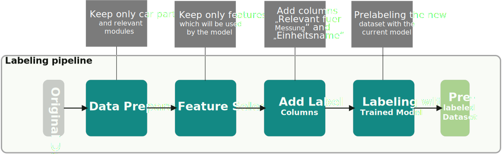
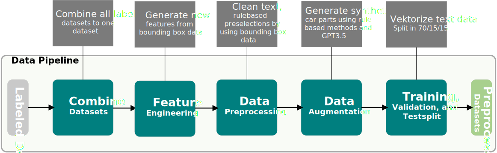

# Component Identification for Geometric Measurements in the Vehicle Development Process Using Machine Learning

## 📖 Quick Index

* [💻 Installation](#-installation)
* [🐍 Usage](#-usage-in-python)
* [🚀 Updates](#-updates)

## 💻 Installation
1. Clone or download the repository
2. (optional) Create a virtuel environment: 
```bash
conda create -n envMesstool python=3.10
```
3. (optional) Activate the created environment 
```bash 
conda activate envMesstool 
```
4. Go to the root directory
5. Installation of the requirements: 
```bash 
pip install -r requirements.txt
``` 
6. Add the data folder to the root directory
7. Perfect, the messtool is ready to use! If not, run 
```bash 
pip install -e .
``` 
or 
```bash
python setup.py install
``` 

## 🐍 Usage in Python
The project contains 5 different pipelines. 
- Labeling pipeline: Preparation of raw data, feature selection, add label columns, and prelabeling with the trained models
- Data pipeline: Combine all datasets to one, feature engineering, data preprocessing, data augmentation, and splitting the dataset into train, validation, and testset
- Training pipeline: Training of the binary and/or multiclass models using grid search hyperparametertuning and k-fold-crossvalidation 
- Explainability pipeline: Create shap plots, tree plots, and store the feature importantance for the final models 
- Deployment pipeline: Deploy the model using FastAPI and Docker or using a Streamlit website

Since there is no data given in this repository, please add the following folder structure to the root:
The following folder structure is required for this: </br>
master-thesis/ </br>
├─ data/ </br>
│  ├─ labeled/ </br>
│  ├─ pre_labeled/ </br>
│  ├─ processed/ </br>
│  ├─ preprocessed/ </br>
│  ├─ raw/ </br> 
│  ├─ raw_for_labeling/ </br>

### Labeling pipeline


This pipeline is used for preparing and prelabeling the raw data. 

The first step in using this pipeline is to add all raw datasets (excel files), which you want to add for training new models, to the raw_for_labeling folder. Each excel file contains the structure tree of one vehicle and have to include at least all relevant attributes, which are:
- Sachnummer
- Benennung (dt)
- X-Min
- X-Max
- Y-Min
- Y-Max
- Z-Min
- Z-Max
- Wert
- Einheit
- Gewichtsart
- Kurzname
- L-Kz.
- L/R-Kz.
- Modul (Nr)
- Code
- ox
- oy
- oz
- xx
- xy
- xz
- yx
- yy
- yz
- zx
- zy
- zz

After that, run the **label.py** file which you can find here: </br>
master-thesis/  </br>
├─ src/ </br>
│  ├─ labeling_pipeline/ </br>
│  │  ├─ label.py </br>

This file will apply the following steps:
- **Data Preparation**: Keeps only vehicle parts from relevant modules. All parent folders are removed
- **Feature Selection**: Keeps only the features which are used for training the models
- **Add label columns**: Adding and initializing the label columns ("Relevant fuer Messung" with 0 and "Einheitsname" with "Dummy")
- **Prelabeling**: Using the trained model to identify the relevant car parts and classify a uniform name ("Einheitsname") for each relevant car part

After these steps, the prepared and prelabeled datasets are stored in the folder "pre_labeled". 
Now please check carefully if the records are labeled correctly. If not, you will have to correct this manually.
This is a critical part, because incorrectly labeled data can lead to a significant drop in performance!

After reviewing the pre-labeled datasets, move them to the labeled folder.

DONE!

### Data pipeline


This pipeline is used to generate a new training, validation, and testsplit for training the models.
In the first step, all datasets which are in the data folder "labeled" will combined to one.   
Then, in the feature engineering step, the bounding box information is converted so that the number of features is reduced. 
In the original data set, a bounding box is represented by the minimum and maximum values in x,y,z, a shift vector and a rotation matrix. Here, this information is used to convert it into the length, width, height, the center point and an orientation vector of the bounding box. This reduces the number of features for the representation of the bounding box from 18 to 6 features. In addition, two more features (volume and density) are calculate.
The next step is the preprocessing of the data set. This involves a pre-selection of irrelevant car components based on the bounding box features (volume and position) and a cleaning of the component designations and their conversion into numerical vectors.
Since a stratified training/validation/test split is used to ensure that the datasets are balanced across classes, some data augmentation techniques are used as needed to create synthetic car parts. The goal here is to have at least 2 / (1 - percentage trainset/100) car parts, so that each split has at least one car part for each uniform name. The synthetic designations are generated by adding random mistakes, switching words or generating new designations using GPT3.5. The synthetic bounding box information is randomly generated, however, it must be within a validated range in terms of position, length, width, height and volume to the original components of the same class. The other features are copied from the original car parts. 

The last step splits the dataset at first into 1-x training and x validation set. Then, the validationset is splitted into 1-x validationset and x testset. (x can be defined in the config.yaml file)

DONE! The preprocessed records are now stored in the "processed" data folder as dictionaries in multiple pickle files.

### Training pipeline
### Explainability pipeline
### Deployment pipeline

## 🚀 Updates

**2023.05.01**